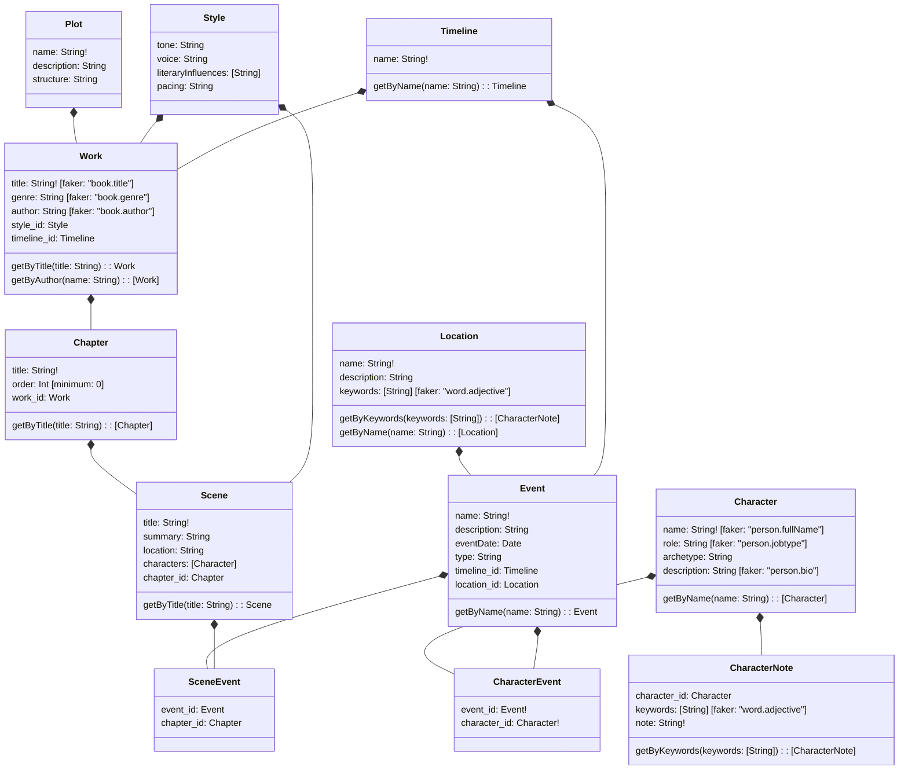

# AIMusing

AIMusing is an AI-assisted novel-writing application built on **meshobj**, designed to dynamically respond to narrative changes, track character development, and maintain structured storytelling elements.

## Features
- **Restlette / Graphlette API**: Provides structured storage and retrieval of story elements.
- **Event-Driven Workflow**: Automatically processes changes in the story world, propagating them through AI-assisted refinements.
- **AI Agents**:
  - **Checkers**: Validate narrative consistency, style, and plot.
  - **Specialists**: Generate and refine content for specific aspects of the story.
  - **Superego**: Curates ideas, selects the best ones, and delegates execution.
- **Version Control**: All story elements support time-travel queries using `at` parameters.

## Architecture
AIMusing is structured as follows:



## Getting Started
### Prerequisites
- **Docker** (for containerized execution)
- **Node.js / Yarn** (for running the API)
- **Kafka & Debezium** (for event streaming and CDC processing)

### Installation
1. Clone the repository:
   ```sh
   git clone https://github.com/tsmarsh/aimusing.git
   cd aimusing
   ```
2. Install dependencies:
   ```sh
   yarn install
   ```
3. Start the development environment:
   ```sh
   docker-compose up
   ```

## Usage
AIMusing runs as an event-driven system where each **Restlette update** triggers AI processing:
1. **Create a Work**:
   ```sh
   curl -X POST http://localhost:3000/work -d '{"title": "My Novel"}'
   ```
2. **Add a Character**:
   ```sh
   curl -X POST http://localhost:3000/character -d '{"name": "Alice", "role": "Protagonist"}'
   ```
3. **Modify a Scene** → Changes automatically trigger AI agents for validation & refinement.

## Roadmap
- [ ] **Integrate AI Agents** (Checkers, Specialists, Superego)
- [ ] **Implement Event Workflow** (CDC → Debezium → Kafka → Vector Store)
- [ ] **Build an Interactive UI** for writers
- [ ] **Enhance AI Narrative Generation**

## License
This project is licensed under the MIT License.

## Contributions
Contributions are welcome! Open an issue or submit a pull request to get involved.
